# BIMM 143 Lab 7
Daniel Gurholt (PID: A16767491)

Today we are going to learn how to apply different machine learning
methods, beginning with clustering:

The goal here is to find groups/clusters in your input data.

First I will make up some data with clear groups. For this I will use
the `rnorm()` function.

``` r
rnorm(10)
```

     [1]  1.2469417 -0.6828740  0.4250739  0.2968529  0.1422048  0.5804868
     [7]  0.7895357  0.4187587 -0.8459225 -1.1350779

``` r
hist( rnorm(10000, mean=-3))
```

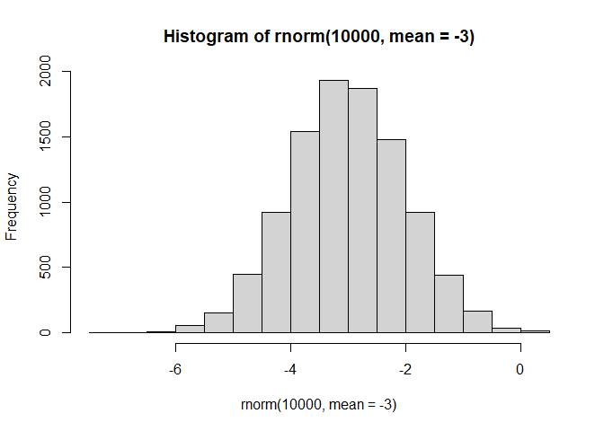

``` r
n<- 10000
x<- c(rnorm(n, -3), rnorm(n, +3))
hist(x)
```

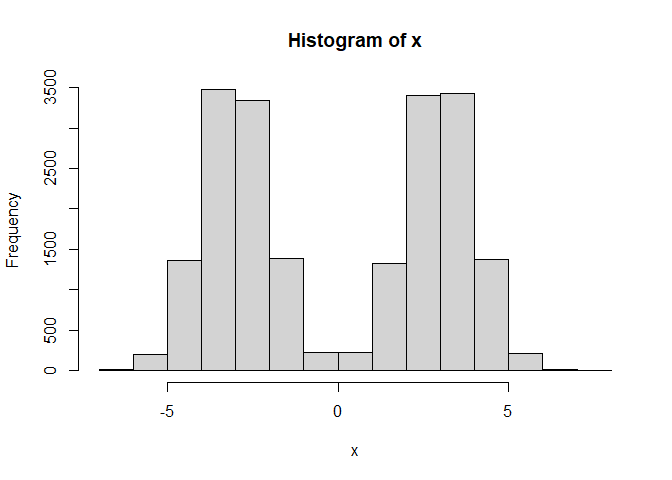

``` r
n<- 30
x<- c(rnorm(n, -3), rnorm(n, +3))
y<- rev(x)

z<- cbind(x, y)
head(z)
```

                 x        y
    [1,] -3.884629 1.818156
    [2,] -3.907671 5.555655
    [3,] -2.854292 3.835009
    [4,] -2.776928 3.817989
    [5,] -2.809109 1.285634
    [6,] -3.333057 3.580188

``` r
plot(z)
```

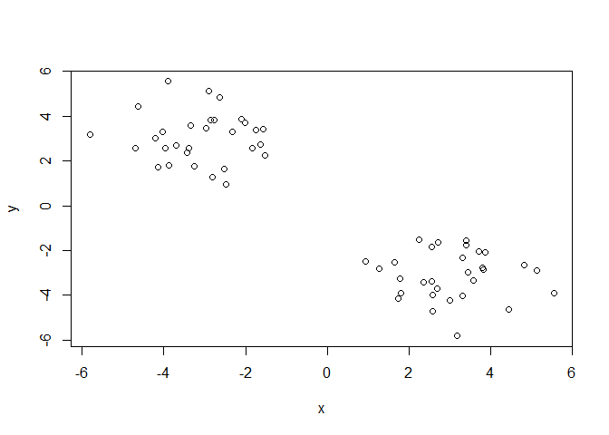

Use the `kmeans()` function setting k to 2 and nstart=20

Inspect/print the results

> Q. How many points are in each cluster?

> Q. What ‘component’ of your result object details - cluster size? -
> cluster assignment/membership? - cluster center?

> Q. Plot x colored by the kmeans cluster assignment and add cluster
> centers as blue points

``` r
km<- kmeans(z, centers= 2)
km
```

    K-means clustering with 2 clusters of sizes 30, 30

    Cluster means:
              x         y
    1  3.048837 -3.102448
    2 -3.102448  3.048837

    Clustering vector:
     [1] 2 2 2 2 2 2 2 2 2 2 2 2 2 2 2 2 2 2 2 2 2 2 2 2 2 2 2 2 2 2 1 1 1 1 1 1 1 1
    [39] 1 1 1 1 1 1 1 1 1 1 1 1 1 1 1 1 1 1 1 1 1 1

    Within cluster sum of squares by cluster:
    [1] 68.11294 68.11294
     (between_SS / total_SS =  89.3 %)

    Available components:

    [1] "cluster"      "centers"      "totss"        "withinss"     "tot.withinss"
    [6] "betweenss"    "size"         "iter"         "ifault"      

Results in kmeans object `km`

``` r
attributes(km)
```

    $names
    [1] "cluster"      "centers"      "totss"        "withinss"     "tot.withinss"
    [6] "betweenss"    "size"         "iter"         "ifault"      

    $class
    [1] "kmeans"

Cluster size?

``` r
km$size
```

    [1] 30 30

Cluster assignment/membership?

``` r
km$cluster
```

     [1] 2 2 2 2 2 2 2 2 2 2 2 2 2 2 2 2 2 2 2 2 2 2 2 2 2 2 2 2 2 2 1 1 1 1 1 1 1 1
    [39] 1 1 1 1 1 1 1 1 1 1 1 1 1 1 1 1 1 1 1 1 1 1

Cluster center?

``` r
km$centers
```

              x         y
    1  3.048837 -3.102448
    2 -3.102448  3.048837

> Q. Plot x colored by the kmeans cluster assignment and add cluster
> centers as blue points

``` r
plot(z, col="red")
```

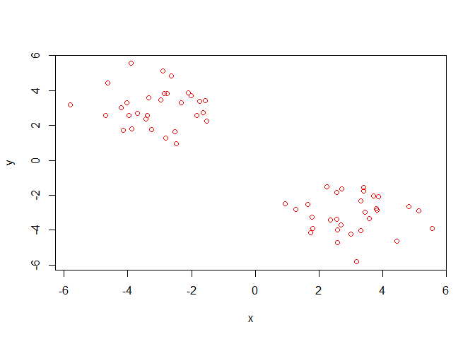

R will recycle the shorter color vector to be the same length as the
longer (number of data points) in z

``` r
plot(z, col=c("red", "blue"))
```

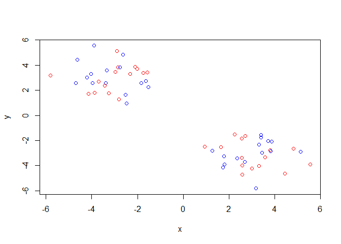

``` r
plot(z, col=km$cluster)
```

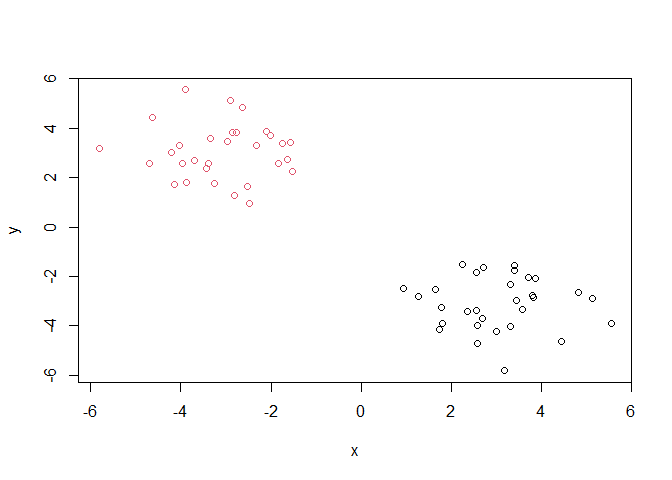

We can use the `points()` function to add new points to existing plots…
like the cluster centers

``` r
plot(z, col=km$cluster)
points(km$centers, col="blue", pch=15, cex=3)
```

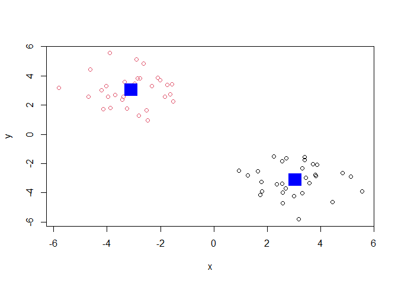

> Q. Can you run kmeans and ask for 4 clusters please and plot the
> results like we have done above?

``` r
km4<- kmeans(z, centers=4)
plot(z, col=km4$cluster)
points(km4$centers, col="blue", pch=15, cex=1.5)
```

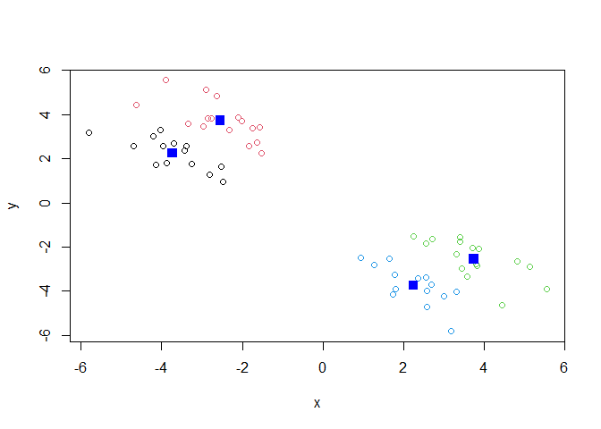

\##Heirarchical clustering

Lets take our same made up data `z` and see how hierarchical clustering
works

First we need a distance matrix of our data to be clustered

``` r
d<- dist(z)
hc<- hclust(d)
hc
```


    Call:
    hclust(d = d)

    Cluster method   : complete 
    Distance         : euclidean 
    Number of objects: 60 

``` r
plot(hc)
abline(h=8, col="red")
```

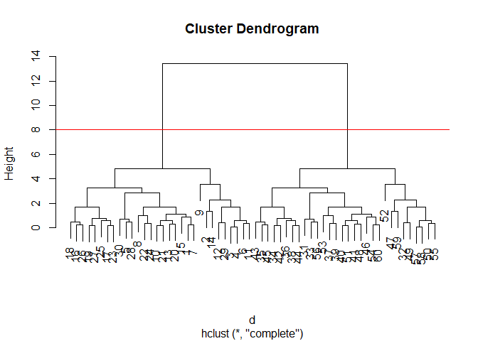

I can get my cluster membership vector by cutting the tree with the
`cutree()` function like so:

``` r
grps<- cutree(hc, h=8)
grps
```

     [1] 1 1 1 1 1 1 1 1 1 1 1 1 1 1 1 1 1 1 1 1 1 1 1 1 1 1 1 1 1 1 2 2 2 2 2 2 2 2
    [39] 2 2 2 2 2 2 2 2 2 2 2 2 2 2 2 2 2 2 2 2 2 2

Can you plot `z` colored by our hclust results:

``` r
plot(z, col=grps)
```

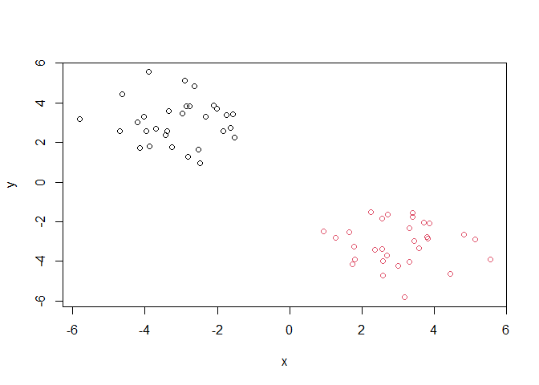

**Hands on with Principal Component Analysis (PCA) of UK Food Data**

``` r
url <- "https://tinyurl.com/UK-foods"
x <- read.csv(url, row.names=1)
head(x)
```

                   England Wales Scotland N.Ireland
    Cheese             105   103      103        66
    Carcass_meat       245   227      242       267
    Other_meat         685   803      750       586
    Fish               147   160      122        93
    Fats_and_oils      193   235      184       209
    Sugars             156   175      147       139

> Q1. How many rows and columns are in your new data frame named x? What
> R functions could you use to answer this questions?

``` r
nrow(x)
```

    [1] 17

``` r
ncol(x)
```

    [1] 4

``` r
dim(x)
```

    [1] 17  4

There are 17 rows and 4 columns in this new data frame using the
functions `nrow`, `ncol`, or `dim()`. Originally there was 5 columns
before we simplified the table and edited the first column.

> Q2. Which approach to solving the ‘row-names problem’ mentioned above
> do you prefer and why? Is one approach more robust than another under
> certain circumstances?

I prefer to use the second approach to solving the row-names problem by
setting row.names=1 because for one it takes less code and can work with
whichever dataset I put in the function. Additionally the first approach
will keep removing columns if you run it over and over again which
doesn’t help.

**Spotting Major Differences and Trends**

``` r
barplot(as.matrix(x), beside=T, col=rainbow(nrow(x)))
```


> Q3: Changing what optional argument in the above barplot() function
> results in the following plot?

Changing the `beside` argument to false will result in the new plot so
now all the different statistics for each country is stacked on top of
eachother instead of side by side.

``` r
barplot(as.matrix(x), beside=F, col=rainbow(nrow(x)))
```


A so-called “pairs plot can be used for small datasets like this one

``` r
pairs(x, col=rainbow(10), pch=16)
```


> Q5: Generating all pairwise plots may help somewhat. Can you make
> sense of the following code and resulting figure? What does it mean if
> a given point lies on the diagonal for a given plot?

The following code creates a pairs plot which compares two variables for
each graph, in this case countries in the UK for food stats. If a given
point lies on the diagonal for a given plot it shows that the data is
similar between the two variables or countries, any point higher or
lower than the diagonal means it differs in some way. The pair plots
doesn’t show much because many points are on the diagonal so it appears
that many countries are the same for now.

> Q6. What is the main differences between N. Ireland and the other
> countries of the UK in terms of this data-set?

It is hard to see structures and trends in even this small dataset. They
all seem to be increasing but there are very few differences between the
countries. How will we ever deal with this in bigger datasets with
1,000s or 10s of thousands of things we are measuring?

## PCA to the rescue

Let’s see how PCA deals with this data set. So main function in base R
to do PCA is called `prcomp()`

``` r
pca<- prcomp( t(x) )
summary(pca)
```

    Importance of components:
                                PC1      PC2      PC3       PC4
    Standard deviation     324.1502 212.7478 73.87622 3.176e-14
    Proportion of Variance   0.6744   0.2905  0.03503 0.000e+00
    Cumulative Proportion    0.6744   0.9650  1.00000 1.000e+00

Let’s see what is inside this `pca` object that I produced from running
`prcomp()`

``` r
attributes(pca)
```

    $names
    [1] "sdev"     "rotation" "center"   "scale"    "x"       

    $class
    [1] "prcomp"

``` r
pca$x
```

                     PC1         PC2        PC3           PC4
    England   -144.99315   -2.532999 105.768945 -4.894696e-14
    Wales     -240.52915 -224.646925 -56.475555  5.700024e-13
    Scotland   -91.86934  286.081786 -44.415495 -7.460785e-13
    N.Ireland  477.39164  -58.901862  -4.877895  2.321303e-13

``` r
plot(pca$x[,1], pca$x[,2], col=c("black", "red", "blue", "darkgreen"), pch=16, xlab="PC1 (67.4%)", ylab="PC2 (29%)")
text(pca$x[,1], pca$x[,2], colnames(x))
```

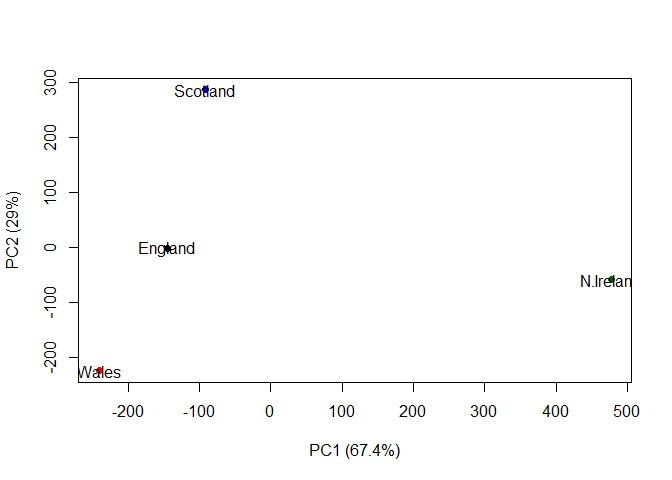

> Q8. Customize your plot so that the colors of the country names match
> the colors in our UK and Ireland map and table at start of this
> document.

``` r
plot(pca$x[,1], pca$x[,2], xlab="PC1 (67.4%)", ylab="PC2 (29%)", xlim=c(-270,500))
text(pca$x[,1], pca$x[,2], colnames(x), col=c("orange", "red", "blue", "darkgreen"))
```

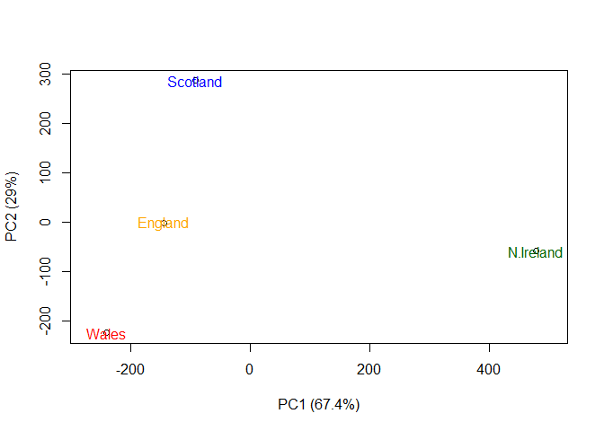

``` r
v <- round( pca$sdev^2/sum(pca$sdev^2) * 100 )
v
```

    [1] 67 29  4  0

``` r
z <- summary(pca)
z$importance
```

                                 PC1       PC2      PC3          PC4
    Standard deviation     324.15019 212.74780 73.87622 3.175833e-14
    Proportion of Variance   0.67444   0.29052  0.03503 0.000000e+00
    Cumulative Proportion    0.67444   0.96497  1.00000 1.000000e+00

``` r
barplot(v, xlab="Principal Component", ylab="Percent Variation")
```


**Digging deeper (variable loadings)**

``` r
## Lets focus on PC1 as it accounts for > 90% of variance 

par(mar=c(10, 3, 0.35, 0))
barplot( pca$rotation[,1], las=2 )
```


> Q9: Generate a similar ‘loadings plot’ for PC2. What two food groups
> feature prominantely and what does PC2 maninly tell us about?

``` r
par(mar=c(10, 3, 0.35, 0))
barplot( pca$rotation[,2], las=2 )
```


Looking at the graph for PC2 shows us that only soft drinks and fresh
potatoes are featured prominently, but now only soft drinks are skewing
N. Ireland to the right of the PCA and fresh potatoes is negative which
means that it is skewing all other countries to the left of the PCA.

**PCA of RNA-seq data**

``` r
url2 <- "https://tinyurl.com/expression-CSV"
rna.data <- read.csv(url2, row.names=1)
head(rna.data)
```

           wt1 wt2  wt3  wt4 wt5 ko1 ko2 ko3 ko4 ko5
    gene1  439 458  408  429 420  90  88  86  90  93
    gene2  219 200  204  210 187 427 423 434 433 426
    gene3 1006 989 1030 1017 973 252 237 238 226 210
    gene4  783 792  829  856 760 849 856 835 885 894
    gene5  181 249  204  244 225 277 305 272 270 279
    gene6  460 502  491  491 493 612 594 577 618 638

> Q10: How many genes and samples are in this data set?

``` r
nrow(rna.data)
```

    [1] 100

``` r
ncol(rna.data)
```

    [1] 10

``` r
dim(rna.data)
```

    [1] 100  10

Since there are 100 rows and 10 columns in this data set, there are 100
genes and 10 samples for each gene in this data set.
