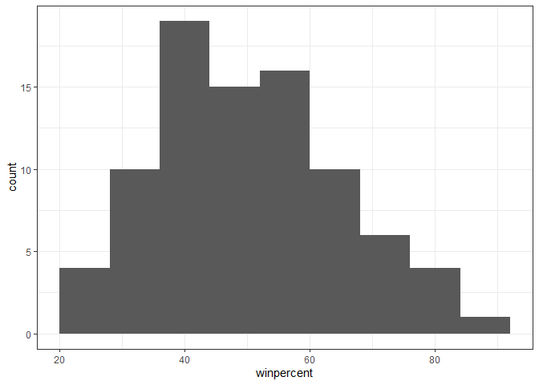
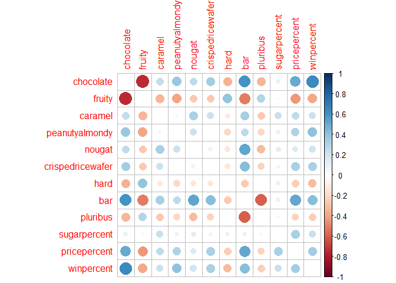

# Lab 10 Halloween Candy Mini Project
Daniel Gurholt (PID: A16767491)

\##Importing candy data

``` r
candy_file <- "candy-data.csv"

candy = read.csv(candy_file, row.names=1)
head(candy)
```

                 chocolate fruity caramel peanutyalmondy nougat crispedricewafer
    100 Grand            1      0       1              0      0                1
    3 Musketeers         1      0       0              0      1                0
    One dime             0      0       0              0      0                0
    One quarter          0      0       0              0      0                0
    Air Heads            0      1       0              0      0                0
    Almond Joy           1      0       0              1      0                0
                 hard bar pluribus sugarpercent pricepercent winpercent
    100 Grand       0   1        0        0.732        0.860   66.97173
    3 Musketeers    0   1        0        0.604        0.511   67.60294
    One dime        0   0        0        0.011        0.116   32.26109
    One quarter     0   0        0        0.011        0.511   46.11650
    Air Heads       0   0        0        0.906        0.511   52.34146
    Almond Joy      0   1        0        0.465        0.767   50.34755

> Q1. How many different candy types are in this dataset?

``` r
nrow(candy)
```

    [1] 85

There are 85 different types of candy types in this dataset.

> Q2. How many fruity candy types are in the dataset?

``` r
sum(candy[,"fruity"])
```

    [1] 38

There are 38 types of fruity candy in this dataset

\##What is your favorate candy?

> Q3. What is your favorite candy in the dataset and what is it’s
> winpercent value?

``` r
candy["Junior Mints", ]$winpercent
```

    [1] 57.21925

My favorite candy is Junior Mints, with a winpercent value of 57.2%

> Q. Can you find all candies with a win percent above 50 that are
> fruity?

``` r
library(dplyr)
```


    Attaching package: 'dplyr'

    The following objects are masked from 'package:stats':

        filter, lag

    The following objects are masked from 'package:base':

        intersect, setdiff, setequal, union

``` r
candy |>
  filter(winpercent > 50) |>
  filter(fruity==1)
```

                                chocolate fruity caramel peanutyalmondy nougat
    Air Heads                           0      1       0              0      0
    Haribo Gold Bears                   0      1       0              0      0
    Haribo Sour Bears                   0      1       0              0      0
    Lifesavers big ring gummies         0      1       0              0      0
    Nerds                               0      1       0              0      0
    Skittles original                   0      1       0              0      0
    Skittles wildberry                  0      1       0              0      0
    Sour Patch Kids                     0      1       0              0      0
    Sour Patch Tricksters               0      1       0              0      0
    Starburst                           0      1       0              0      0
    Swedish Fish                        0      1       0              0      0
                                crispedricewafer hard bar pluribus sugarpercent
    Air Heads                                  0    0   0        0        0.906
    Haribo Gold Bears                          0    0   0        1        0.465
    Haribo Sour Bears                          0    0   0        1        0.465
    Lifesavers big ring gummies                0    0   0        0        0.267
    Nerds                                      0    1   0        1        0.848
    Skittles original                          0    0   0        1        0.941
    Skittles wildberry                         0    0   0        1        0.941
    Sour Patch Kids                            0    0   0        1        0.069
    Sour Patch Tricksters                      0    0   0        1        0.069
    Starburst                                  0    0   0        1        0.151
    Swedish Fish                               0    0   0        1        0.604
                                pricepercent winpercent
    Air Heads                          0.511   52.34146
    Haribo Gold Bears                  0.465   57.11974
    Haribo Sour Bears                  0.465   51.41243
    Lifesavers big ring gummies        0.279   52.91139
    Nerds                              0.325   55.35405
    Skittles original                  0.220   63.08514
    Skittles wildberry                 0.220   55.10370
    Sour Patch Kids                    0.116   59.86400
    Sour Patch Tricksters              0.116   52.82595
    Starburst                          0.220   67.03763
    Swedish Fish                       0.755   54.86111

> Q4. What is the winpercent value for “Kit Kat”?

``` r
candy["Kit Kat", ]$winpercent
```

    [1] 76.7686

The win percent for Kit Kat is 76.8%

> Q5. What is the winpercent value for “Tootsie Roll Snack Bars”?

``` r
candy["Tootsie Roll Snack Bars", ]$winpercent
```

    [1] 49.6535

The win percent for Tootsie Roll Snack Bars is 49.7%

``` r
library("skimr")
skim(candy)
```

|                                                  |       |
|:-------------------------------------------------|:------|
| Name                                             | candy |
| Number of rows                                   | 85    |
| Number of columns                                | 12    |
| \_\_\_\_\_\_\_\_\_\_\_\_\_\_\_\_\_\_\_\_\_\_\_   |       |
| Column type frequency:                           |       |
| numeric                                          | 12    |
| \_\_\_\_\_\_\_\_\_\_\_\_\_\_\_\_\_\_\_\_\_\_\_\_ |       |
| Group variables                                  | None  |

Data summary

**Variable type: numeric**

| skim_variable | n_missing | complete_rate | mean | sd | p0 | p25 | p50 | p75 | p100 | hist |
|:---|---:|---:|---:|---:|---:|---:|---:|---:|---:|:---|
| chocolate | 0 | 1 | 0.44 | 0.50 | 0.00 | 0.00 | 0.00 | 1.00 | 1.00 | ▇▁▁▁▆ |
| fruity | 0 | 1 | 0.45 | 0.50 | 0.00 | 0.00 | 0.00 | 1.00 | 1.00 | ▇▁▁▁▆ |
| caramel | 0 | 1 | 0.16 | 0.37 | 0.00 | 0.00 | 0.00 | 0.00 | 1.00 | ▇▁▁▁▂ |
| peanutyalmondy | 0 | 1 | 0.16 | 0.37 | 0.00 | 0.00 | 0.00 | 0.00 | 1.00 | ▇▁▁▁▂ |
| nougat | 0 | 1 | 0.08 | 0.28 | 0.00 | 0.00 | 0.00 | 0.00 | 1.00 | ▇▁▁▁▁ |
| crispedricewafer | 0 | 1 | 0.08 | 0.28 | 0.00 | 0.00 | 0.00 | 0.00 | 1.00 | ▇▁▁▁▁ |
| hard | 0 | 1 | 0.18 | 0.38 | 0.00 | 0.00 | 0.00 | 0.00 | 1.00 | ▇▁▁▁▂ |
| bar | 0 | 1 | 0.25 | 0.43 | 0.00 | 0.00 | 0.00 | 0.00 | 1.00 | ▇▁▁▁▂ |
| pluribus | 0 | 1 | 0.52 | 0.50 | 0.00 | 0.00 | 1.00 | 1.00 | 1.00 | ▇▁▁▁▇ |
| sugarpercent | 0 | 1 | 0.48 | 0.28 | 0.01 | 0.22 | 0.47 | 0.73 | 0.99 | ▇▇▇▇▆ |
| pricepercent | 0 | 1 | 0.47 | 0.29 | 0.01 | 0.26 | 0.47 | 0.65 | 0.98 | ▇▇▇▇▆ |
| winpercent | 0 | 1 | 50.32 | 14.71 | 22.45 | 39.14 | 47.83 | 59.86 | 84.18 | ▃▇▆▅▂ |

> Q6. Is there any variable/column that looks to be on a different scale
> to the majority of the other columns in the dataset?

The winpercent variable looks to be on a different scale to the majority
of the other columns in the dataset.

> Q7. What do you think a zero and one represent for the
> candy\$chocolate column?

A zero represents types of candy that do not have chocolate and a one
represents candy that does contain chocolate in the dataset.

> Q8. Plot a histogram of winpercent values

``` r
hist(candy$winpercent, breaks=10)
```


``` r
library(ggplot2)
ggplot(candy, aes(winpercent)) +
  geom_histogram(binwidth = 8)+ 
  theme_bw()
```



> Q9. Is the distribution of winpercent values symmetrical?

No, the distribution of winpercent values symmetrical, and looks
slightly skewed.

> Q10. Is the center of the distribution above or below 50%?

``` r
summary(candy$winpercent)
```

       Min. 1st Qu.  Median    Mean 3rd Qu.    Max. 
      22.45   39.14   47.83   50.32   59.86   84.18 

The center of distribution is below 50% as seen from the median in the
code above.

> Q11. On average is chocolate candy higher or lower ranked than fruit
> candy?

``` r
fruit.candy<- candy |>
  filter(fruity==1)

summary(fruit.candy$winpercent)
```

       Min. 1st Qu.  Median    Mean 3rd Qu.    Max. 
      22.45   39.04   42.97   44.12   52.11   67.04 

``` r
choc.candy<- candy |>
  filter(chocolate==1)

summary(choc.candy$winpercent)
```

       Min. 1st Qu.  Median    Mean 3rd Qu.    Max. 
      34.72   50.35   60.80   60.92   70.74   84.18 

Chocolate candy is on average higher ranked than fruity candy since
chocolate has botha higher mean and median than fruity candy.

> Q12. Is this difference statistically significant?

``` r
t.test(choc.candy$winpercent, fruit.candy$winpercent)
```


        Welch Two Sample t-test

    data:  choc.candy$winpercent and fruit.candy$winpercent
    t = 6.2582, df = 68.882, p-value = 2.871e-08
    alternative hypothesis: true difference in means is not equal to 0
    95 percent confidence interval:
     11.44563 22.15795
    sample estimates:
    mean of x mean of y 
     60.92153  44.11974 

Since the p-value is much smaller than the 0.05 threshold, this
difference between chocolate and fruity candy is statistically
significant.

\##Overall Candy Rankings

> Q13. What are the five least liked candy types in this set?

``` r
candy %>% arrange(winpercent) %>% head(5)
```

                       chocolate fruity caramel peanutyalmondy nougat
    Nik L Nip                  0      1       0              0      0
    Boston Baked Beans         0      0       0              1      0
    Chiclets                   0      1       0              0      0
    Super Bubble               0      1       0              0      0
    Jawbusters                 0      1       0              0      0
                       crispedricewafer hard bar pluribus sugarpercent pricepercent
    Nik L Nip                         0    0   0        1        0.197        0.976
    Boston Baked Beans                0    0   0        1        0.313        0.511
    Chiclets                          0    0   0        1        0.046        0.325
    Super Bubble                      0    0   0        0        0.162        0.116
    Jawbusters                        0    1   0        1        0.093        0.511
                       winpercent
    Nik L Nip            22.44534
    Boston Baked Beans   23.41782
    Chiclets             24.52499
    Super Bubble         27.30386
    Jawbusters           28.12744

The five least liked candies are Nik L Nip, Boston Baked Beans, Chiclets
Super Bubble, and Jaw Busters with the lowest winpercent values of the
entire dataset.

> Q14. What are the top 5 all time favorite candy types out of this set?

``` r
candy %>% arrange(winpercent) %>% tail(5)
```

                              chocolate fruity caramel peanutyalmondy nougat
    Snickers                          1      0       1              1      1
    Kit Kat                           1      0       0              0      0
    Twix                              1      0       1              0      0
    Reese's Miniatures                1      0       0              1      0
    Reese's Peanut Butter cup         1      0       0              1      0
                              crispedricewafer hard bar pluribus sugarpercent
    Snickers                                 0    0   1        0        0.546
    Kit Kat                                  1    0   1        0        0.313
    Twix                                     1    0   1        0        0.546
    Reese's Miniatures                       0    0   0        0        0.034
    Reese's Peanut Butter cup                0    0   0        0        0.720
                              pricepercent winpercent
    Snickers                         0.651   76.67378
    Kit Kat                          0.511   76.76860
    Twix                             0.906   81.64291
    Reese's Miniatures               0.279   81.86626
    Reese's Peanut Butter cup        0.651   84.18029

The top 5 all time favorite favorite candy types in this data set are
Snickers, Kit Kat, Twix, Reese’s Miniatures, and Reese’s Peanut Butter
cup with the highest winpercent values.

> Q15. Make a first barplot of candy ranking based on winpercent values.

``` r
ggplot(candy)+
  aes(winpercent, rownames(candy))+
  geom_col()
```


> Q16. This is quite ugly, use the reorder() function to get the bars
> sorted by winpercent?

``` r
ggplot(candy)+
  aes(winpercent, reorder(rownames(candy), winpercent))+
  geom_col()
```


``` r
ggplot(candy)+
  aes(winpercent, reorder(rownames(candy), winpercent), fill=chocolate)+
  geom_col()
```


I want a more specialized/custom color scale where I can see both
chocolate and fruity etc. a;l in one plot. To do this we can roll our
own color vector.

``` r
# Place holder color vector

mycols<- rep("black",nrow(candy))
mycols[as.logical(candy$chocolate)]<- "chocolate"
mycols[as.logical(candy$bar)]<- "brown"
mycols[as.logical(candy$fruity)]<- "pink"
mycols
```

     [1] "brown"     "brown"     "black"     "black"     "pink"      "brown"    
     [7] "brown"     "black"     "black"     "pink"      "brown"     "pink"     
    [13] "pink"      "pink"      "pink"      "pink"      "pink"      "pink"     
    [19] "pink"      "black"     "pink"      "pink"      "chocolate" "brown"    
    [25] "brown"     "brown"     "pink"      "chocolate" "brown"     "pink"     
    [31] "pink"      "pink"      "chocolate" "chocolate" "pink"      "chocolate"
    [37] "brown"     "brown"     "brown"     "brown"     "brown"     "pink"     
    [43] "brown"     "brown"     "pink"      "pink"      "brown"     "chocolate"
    [49] "black"     "pink"      "pink"      "chocolate" "chocolate" "chocolate"
    [55] "chocolate" "pink"      "chocolate" "black"     "pink"      "chocolate"
    [61] "pink"      "pink"      "chocolate" "pink"      "brown"     "brown"    
    [67] "pink"      "pink"      "pink"      "pink"      "black"     "black"    
    [73] "pink"      "pink"      "pink"      "chocolate" "chocolate" "brown"    
    [79] "pink"      "brown"     "pink"      "pink"      "pink"      "black"    
    [85] "chocolate"

``` r
mycols[rownames(candy)=="Junior Mints"]<- "blue"
```

``` r
#Use blue for your favorite candy!
ggplot(candy)+
  aes(winpercent, reorder(rownames(candy), winpercent))+
  geom_col(fill=mycols)
```


> Q17. What is the worst ranked chocolate candy?

Sixlets is the worst ranked chocolate candy.

> Q18. What is the best ranked fruity candy?

Starburst is the best ranked fruity candy.

\##Taking a look at pricepercent

Plot of winpercent vs pricepercent

``` r
mycols[as.logical(candy$fruity)]<- "purple"
```

``` r
ggplot(candy)+
  aes(winpercent, pricepercent) +
  geom_point(col=mycols)
```


Add Labels

``` r
ggplot(candy)+
  aes(winpercent, pricepercent, label=rownames(candy)) +
  geom_point(col=mycols) +
  geom_label(col=mycols)
```


``` r
library(ggrepel)
ggplot(candy)+
  aes(winpercent, pricepercent, label=rownames(candy)) +
  geom_point(col=mycols) +
  geom_text_repel(col=mycols, max.overlaps= 8)
```

    Warning: ggrepel: 37 unlabeled data points (too many overlaps). Consider
    increasing max.overlaps


> Q19. Which candy type is the highest ranked in terms of winpercent for
> the least money - i.e. offers the most bang for your buck?

Reese’s Miniatures is the highest ranked in terms of winpercent for the
least money when looking at the scatterplot.

> Q20. What are the top 5 most expensive candy types in the dataset and
> of these which is the least popular?

``` r
ord <- order(candy$pricepercent, decreasing = TRUE)
head( candy[ord,c(11,12)], n=5 )
```

                             pricepercent winpercent
    Nik L Nip                       0.976   22.44534
    Nestle Smarties                 0.976   37.88719
    Ring pop                        0.965   35.29076
    Hershey's Krackel               0.918   62.28448
    Hershey's Milk Chocolate        0.918   56.49050

The top 5 most expensive candies are Nik L Nip, Nestle smarties, Ring
Pop, Hershey’s Krackel, and Hershey’s Milk chocolate. Of these, the
least popular one is Nik L Nip.

> Q21. Make a barplot again with geom_col() this time using pricepercent
> and then improve this step by step, first ordering the x-axis by value
> and finally making a so called “dot chat” or “lollipop” chart by
> swapping geom_col() for geom_point() + geom_segment().

``` r
ggplot(candy)+
  aes(pricepercent, reorder(rownames(candy), pricepercent))+
  geom_segment(aes(yend = reorder(rownames(candy), pricepercent), 
                   xend = 0), col="gray40") +
  geom_point()
```


\##Exploring the correlation structure

``` r
library(corrplot)
```

    corrplot 0.95 loaded

``` r
cij<- cor(candy)
corrplot(cij, diag=F)
```



> Q22. Examining this plot what two variables are anti-correlated
> (i.e. have minus values)?

Upon examining the plot, the chocolate and fruity variables are
anti-correlated as they do not appear together in this dataset with a
very negative correlation value.

> Q23. Similarly, what two variables are most positively correlated?

Upon examining the plot, the chocolate and winpercent or chocolate and
bar are the most positively correlated as they frequently appear
together in this dataset with a very positive correlation value.

\##Principal Component Analysis

``` r
pca<- prcomp(candy, scale=T)
summary(pca)
```

    Importance of components:
                              PC1    PC2    PC3     PC4    PC5     PC6     PC7
    Standard deviation     2.0788 1.1378 1.1092 1.07533 0.9518 0.81923 0.81530
    Proportion of Variance 0.3601 0.1079 0.1025 0.09636 0.0755 0.05593 0.05539
    Cumulative Proportion  0.3601 0.4680 0.5705 0.66688 0.7424 0.79830 0.85369
                               PC8     PC9    PC10    PC11    PC12
    Standard deviation     0.74530 0.67824 0.62349 0.43974 0.39760
    Proportion of Variance 0.04629 0.03833 0.03239 0.01611 0.01317
    Cumulative Proportion  0.89998 0.93832 0.97071 0.98683 1.00000

``` r
plot(pca$x[,1], pca$x[,2], col=mycols, pch=16)
```


``` r
p<- ggplot(candy)+
  aes(pca$x[,1], pca$x[,2], size=winpercent/100,  
            text=rownames(candy),
            label=rownames(candy))+
  geom_point(col=mycols)

p
```


``` r
library(ggrepel)

p + geom_text_repel(size=3.3, col=mycols, max.overlaps = 7)  + 
  theme(legend.position = "none") +
  labs(title="Halloween Candy PCA Space",
       subtitle="Colored by type: chocolate bar (dark brown), chocolate other (light brown), fruity (red), other (black)",
       caption="Data from 538")
```

    Warning: ggrepel: 43 unlabeled data points (too many overlaps). Consider
    increasing max.overlaps


How do the original variables (columns) contribute to the new PCs. I
will look at PC1 here.

``` r
loadings<- as.data.frame(pca$rotation)

ggplot(loadings)+
  aes(PC1, reorder(rownames(loadings), PC1), fill=PC1) +
  geom_col()
```


``` r
par(mar=c(8,4,2,2))
barplot(pca$rotation[,1], las=2, ylab="PC1 Contribution")
```


> Q24. What original variables are picked up strongly by PC1 in the
> positive direction? Do these make sense to you?

Pluribus, hard, and fruity are three original variables that are picked
up strongly by PC1 in the positive direction. This makes sense to me
because all the fruity candies are concentrated on the right/positive
side of the pca comparison scatter plot compared to all the chocolates
being separated on the left. Additionally, it makes sense that fruity
would be related to hard since most fruity candies are hard and are
pluribus which means that many come in one bag which is not very common
with chocolates that are soft and usually not fruity at least in this
data set.
