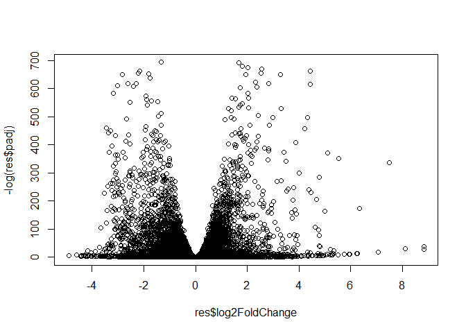
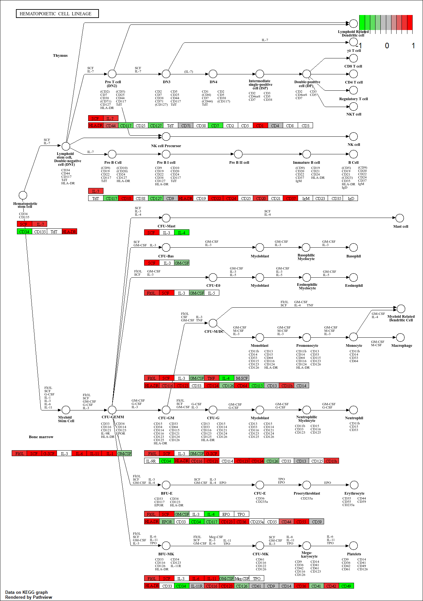
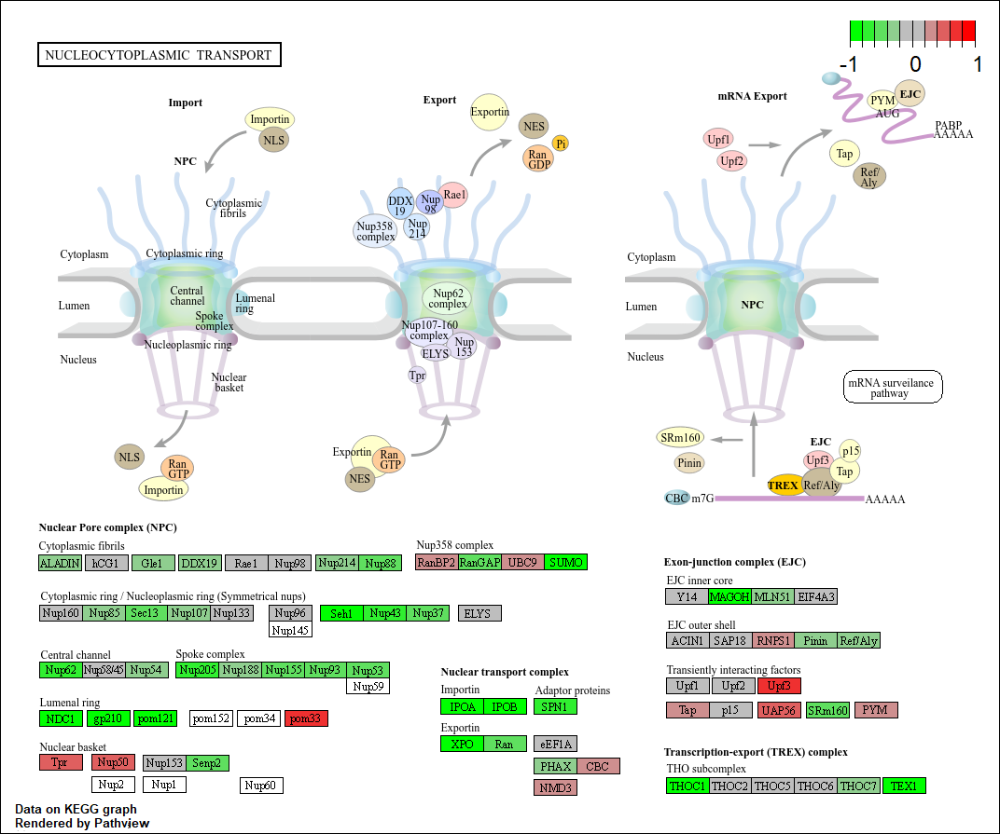

# Lab 14 RNA-Seq analysis mini-project
Daniel Gurholt (PID: A16767491)

\##Our intention is typically to use such lists to gain novel insights
about genes and proteins that may have roles in a given phenomenon,
phenotype or disease progression. However, in many cases these ‘raw’
gene lists are challenging to interpret due to their large size and lack
of useful annotations. Hence, our expensively assembled gene lists often
fail to convey the full degree of possible insight about the condition
being studied.

\##Pathway analysis (also known as gene set analysis or
over-representation analysis), aims to reduce the complexity of
interpreting gene lists via mapping the listed genes to known
(i.e. annotated) biological pathways, processes and functions.

\##Section 1. Differential Expression Analysis

``` r
library(DESeq2)
```

    Loading required package: S4Vectors

    Loading required package: stats4

    Loading required package: BiocGenerics


    Attaching package: 'BiocGenerics'

    The following objects are masked from 'package:stats':

        IQR, mad, sd, var, xtabs

    The following objects are masked from 'package:base':

        anyDuplicated, aperm, append, as.data.frame, basename, cbind,
        colnames, dirname, do.call, duplicated, eval, evalq, Filter, Find,
        get, grep, grepl, intersect, is.unsorted, lapply, Map, mapply,
        match, mget, order, paste, pmax, pmax.int, pmin, pmin.int,
        Position, rank, rbind, Reduce, rownames, sapply, setdiff, table,
        tapply, union, unique, unsplit, which.max, which.min


    Attaching package: 'S4Vectors'

    The following object is masked from 'package:utils':

        findMatches

    The following objects are masked from 'package:base':

        expand.grid, I, unname

    Loading required package: IRanges


    Attaching package: 'IRanges'

    The following object is masked from 'package:grDevices':

        windows

    Loading required package: GenomicRanges

    Loading required package: GenomeInfoDb

    Loading required package: SummarizedExperiment

    Loading required package: MatrixGenerics

    Loading required package: matrixStats

    Warning: package 'matrixStats' was built under R version 4.4.2


    Attaching package: 'MatrixGenerics'

    The following objects are masked from 'package:matrixStats':

        colAlls, colAnyNAs, colAnys, colAvgsPerRowSet, colCollapse,
        colCounts, colCummaxs, colCummins, colCumprods, colCumsums,
        colDiffs, colIQRDiffs, colIQRs, colLogSumExps, colMadDiffs,
        colMads, colMaxs, colMeans2, colMedians, colMins, colOrderStats,
        colProds, colQuantiles, colRanges, colRanks, colSdDiffs, colSds,
        colSums2, colTabulates, colVarDiffs, colVars, colWeightedMads,
        colWeightedMeans, colWeightedMedians, colWeightedSds,
        colWeightedVars, rowAlls, rowAnyNAs, rowAnys, rowAvgsPerColSet,
        rowCollapse, rowCounts, rowCummaxs, rowCummins, rowCumprods,
        rowCumsums, rowDiffs, rowIQRDiffs, rowIQRs, rowLogSumExps,
        rowMadDiffs, rowMads, rowMaxs, rowMeans2, rowMedians, rowMins,
        rowOrderStats, rowProds, rowQuantiles, rowRanges, rowRanks,
        rowSdDiffs, rowSds, rowSums2, rowTabulates, rowVarDiffs, rowVars,
        rowWeightedMads, rowWeightedMeans, rowWeightedMedians,
        rowWeightedSds, rowWeightedVars

    Loading required package: Biobase

    Welcome to Bioconductor

        Vignettes contain introductory material; view with
        'browseVignettes()'. To cite Bioconductor, see
        'citation("Biobase")', and for packages 'citation("pkgname")'.


    Attaching package: 'Biobase'

    The following object is masked from 'package:MatrixGenerics':

        rowMedians

    The following objects are masked from 'package:matrixStats':

        anyMissing, rowMedians

``` r
metaFile <- "GSE37704_metadata.csv"
countFile <- "GSE37704_featurecounts.csv"

# Import metadata and take a peak
colData = read.csv(metaFile, row.names=1)
head(colData)
```

                  condition
    SRR493366 control_sirna
    SRR493367 control_sirna
    SRR493368 control_sirna
    SRR493369      hoxa1_kd
    SRR493370      hoxa1_kd
    SRR493371      hoxa1_kd

``` r
countData = read.csv(countFile, row.names=1)
head(countData)
```

                    length SRR493366 SRR493367 SRR493368 SRR493369 SRR493370
    ENSG00000186092    918         0         0         0         0         0
    ENSG00000279928    718         0         0         0         0         0
    ENSG00000279457   1982        23        28        29        29        28
    ENSG00000278566    939         0         0         0         0         0
    ENSG00000273547    939         0         0         0         0         0
    ENSG00000187634   3214       124       123       205       207       212
                    SRR493371
    ENSG00000186092         0
    ENSG00000279928         0
    ENSG00000279457        46
    ENSG00000278566         0
    ENSG00000273547         0
    ENSG00000187634       258

> Q. Complete the code below to remove the troublesome first column from
> countData

``` r
# Note we need to remove the odd first $length col
countData <- as.matrix(countData[,-1])
head(countData)
```

                    SRR493366 SRR493367 SRR493368 SRR493369 SRR493370 SRR493371
    ENSG00000186092         0         0         0         0         0         0
    ENSG00000279928         0         0         0         0         0         0
    ENSG00000279457        23        28        29        29        28        46
    ENSG00000278566         0         0         0         0         0         0
    ENSG00000273547         0         0         0         0         0         0
    ENSG00000187634       124       123       205       207       212       258

> Q. Complete the code below to filter countData to exclude genes
> (i.e. rows) where we have 0 read count across all samples
> (i.e. columns).

Tip: What will rowSums() of countData return and how could you use it in
this context?

``` r
# Filter count data where you have 0 read count across all samples.
countData= countData[rowSums(countData[, -1] == 0) < ncol(countData) - 1, ]
head(countData)
```

                    SRR493366 SRR493367 SRR493368 SRR493369 SRR493370 SRR493371
    ENSG00000279457        23        28        29        29        28        46
    ENSG00000187634       124       123       205       207       212       258
    ENSG00000188976      1637      1831      2383      1226      1326      1504
    ENSG00000187961       120       153       180       236       255       357
    ENSG00000187583        24        48        65        44        48        64
    ENSG00000187642         4         9        16        14        16        16

\##Running DESeq2

``` r
dds = DESeqDataSetFromMatrix(countData=countData,
                             colData=colData,
                             design=~condition)
```

    Warning in DESeqDataSet(se, design = design, ignoreRank): some variables in
    design formula are characters, converting to factors

``` r
dds = DESeq(dds)
```

    estimating size factors

    estimating dispersions

    gene-wise dispersion estimates

    mean-dispersion relationship

    final dispersion estimates

    fitting model and testing

``` r
dds
```

    class: DESeqDataSet 
    dim: 15879 6 
    metadata(1): version
    assays(4): counts mu H cooks
    rownames(15879): ENSG00000279457 ENSG00000187634 ... ENSG00000276345
      ENSG00000271254
    rowData names(22): baseMean baseVar ... deviance maxCooks
    colnames(6): SRR493366 SRR493367 ... SRR493370 SRR493371
    colData names(2): condition sizeFactor

``` r
res = results(dds, contrast=c("condition", "hoxa1_kd", "control_sirna"))
```

> Q. Call the summary() function on your results to get a sense of how
> many genes are up or down-regulated at the default 0.1 p-value cutoff.

``` r
summary(res)
```


    out of 15879 with nonzero total read count
    adjusted p-value < 0.1
    LFC > 0 (up)       : 4364, 27%
    LFC < 0 (down)     : 4418, 28%
    outliers [1]       : 0, 0%
    low counts [2]     : 1538, 9.7%
    (mean count < 1)
    [1] see 'cooksCutoff' argument of ?results
    [2] see 'independentFiltering' argument of ?results

\##Volcono plot

``` r
plot( res$log2FoldChange, -log(res$padj) )
```



> Q. Improve this plot by completing the below code, which adds color
> and axis labels

``` r
# Make a color vector for all genes
mycols <- rep("gray", nrow(res) )

# Color red the genes with absolute fold change above 2
mycols[ abs(res$log2FoldChange) > 2 ] <- "red"

# Color blue those with adjusted p-value less than 0.01
#  and absolute fold change more than 2
inds <- (res$padj < 0.01) & (abs(res$log2FoldChange) > 2 )
mycols[ inds ] <- "blue"

plot( res$log2FoldChange, -log(res$padj), col=mycols, xlab="Log2(FoldChange)", ylab="-Log(P-value)" )
```


\##Adding gene annotation

> Q. Use the mapIDs() function multiple times to add SYMBOL, ENTREZID
> and GENENAME annotation to our results by completing the code below.

``` r
library("AnnotationDbi")
library("org.Hs.eg.db")
```

``` r
columns(org.Hs.eg.db)
```

     [1] "ACCNUM"       "ALIAS"        "ENSEMBL"      "ENSEMBLPROT"  "ENSEMBLTRANS"
     [6] "ENTREZID"     "ENZYME"       "EVIDENCE"     "EVIDENCEALL"  "GENENAME"    
    [11] "GENETYPE"     "GO"           "GOALL"        "IPI"          "MAP"         
    [16] "OMIM"         "ONTOLOGY"     "ONTOLOGYALL"  "PATH"         "PFAM"        
    [21] "PMID"         "PROSITE"      "REFSEQ"       "SYMBOL"       "UCSCKG"      
    [26] "UNIPROT"     

``` r
res$symbol = mapIds(org.Hs.eg.db,
                    keys=row.names(res), 
                    keytype="ENSEMBL",
                    column="SYMBOL",
                    multiVals="first")
```

    'select()' returned 1:many mapping between keys and columns

``` r
res$entrez = mapIds(org.Hs.eg.db,
                    keys=row.names(res),
                    keytype="ENSEMBL",
                    column="ENTREZID",
                    multiVals="first")
```

    'select()' returned 1:many mapping between keys and columns

``` r
res$name =   mapIds(org.Hs.eg.db,
                    keys=row.names(res),
                    keytype="ENSEMBL",
                    column="GENENAME",
                    multiVals="first")
```

    'select()' returned 1:many mapping between keys and columns

``` r
head(res, 10)
```

    log2 fold change (MLE): condition hoxa1_kd vs control_sirna 
    Wald test p-value: condition hoxa1 kd vs control sirna 
    DataFrame with 10 rows and 9 columns
                       baseMean log2FoldChange     lfcSE       stat      pvalue
                      <numeric>      <numeric> <numeric>  <numeric>   <numeric>
    ENSG00000279457   29.913579      0.1792795 0.3245323   0.552424 5.80658e-01
    ENSG00000187634  183.229650      0.4264445 0.1401543   3.042680 2.34482e-03
    ENSG00000188976 1651.188076     -0.6927208 0.0548418 -12.631264 1.41979e-36
    ENSG00000187961  209.637938      0.7297602 0.1317626   5.538448 3.05163e-08
    ENSG00000187583   47.255123      0.0405481 0.2716368   0.149273 8.81338e-01
    ENSG00000187642   11.979750      0.5427396 0.5210745   1.041578 2.97607e-01
    ENSG00000188290  108.922128      2.0570462 0.1967692  10.454108 1.40312e-25
    ENSG00000187608  350.716868      0.2573752 0.1026587   2.507095 1.21728e-02
    ENSG00000188157 9128.439422      0.3899088 0.0467420   8.341716 7.32201e-17
    ENSG00000237330    0.158192      0.7859552 4.0804729   0.192614 8.47261e-01
                           padj      symbol      entrez                   name
                      <numeric> <character> <character>            <character>
    ENSG00000279457 6.77340e-01          NA          NA                     NA
    ENSG00000187634 4.97957e-03      SAMD11      148398 sterile alpha motif ..
    ENSG00000188976 1.69253e-35       NOC2L       26155 NOC2 like nucleolar ..
    ENSG00000187961 1.07765e-07      KLHL17      339451 kelch like family me..
    ENSG00000187583 9.16287e-01     PLEKHN1       84069 pleckstrin homology ..
    ENSG00000187642 3.94333e-01       PERM1       84808 PPARGC1 and ESRR ind..
    ENSG00000188290 1.17812e-24        HES4       57801 hes family bHLH tran..
    ENSG00000187608 2.30000e-02       ISG15        9636 ISG15 ubiquitin like..
    ENSG00000188157 4.26676e-16        AGRN      375790                  agrin
    ENSG00000237330          NA      RNF223      401934 ring finger protein ..

> Q. Finally for this section let’s reorder these results by adjusted
> p-value and save them to a CSV file in your current project directory.

``` r
res = res[order(res$pvalue),]
write.csv(res,file="deseq_results.csv")
```

\##Section 2. Pathway Analysis

``` r
library(pathview)
```

    ##############################################################################
    Pathview is an open source software package distributed under GNU General
    Public License version 3 (GPLv3). Details of GPLv3 is available at
    http://www.gnu.org/licenses/gpl-3.0.html. Particullary, users are required to
    formally cite the original Pathview paper (not just mention it) in publications
    or products. For details, do citation("pathview") within R.

    The pathview downloads and uses KEGG data. Non-academic uses may require a KEGG
    license agreement (details at http://www.kegg.jp/kegg/legal.html).
    ##############################################################################

``` r
library(gage)
```

``` r
library(gageData)

data(kegg.sets.hs)
data(sigmet.idx.hs)

# Focus on signaling and metabolic pathways only
kegg.sets.hs = kegg.sets.hs[sigmet.idx.hs]

# Examine the first 3 pathways
head(kegg.sets.hs, 3)
```

    $`hsa00232 Caffeine metabolism`
    [1] "10"   "1544" "1548" "1549" "1553" "7498" "9"   

    $`hsa00983 Drug metabolism - other enzymes`
     [1] "10"     "1066"   "10720"  "10941"  "151531" "1548"   "1549"   "1551"  
     [9] "1553"   "1576"   "1577"   "1806"   "1807"   "1890"   "221223" "2990"  
    [17] "3251"   "3614"   "3615"   "3704"   "51733"  "54490"  "54575"  "54576" 
    [25] "54577"  "54578"  "54579"  "54600"  "54657"  "54658"  "54659"  "54963" 
    [33] "574537" "64816"  "7083"   "7084"   "7172"   "7363"   "7364"   "7365"  
    [41] "7366"   "7367"   "7371"   "7372"   "7378"   "7498"   "79799"  "83549" 
    [49] "8824"   "8833"   "9"      "978"   

    $`hsa00230 Purine metabolism`
      [1] "100"    "10201"  "10606"  "10621"  "10622"  "10623"  "107"    "10714" 
      [9] "108"    "10846"  "109"    "111"    "11128"  "11164"  "112"    "113"   
     [17] "114"    "115"    "122481" "122622" "124583" "132"    "158"    "159"   
     [25] "1633"   "171568" "1716"   "196883" "203"    "204"    "205"    "221823"
     [33] "2272"   "22978"  "23649"  "246721" "25885"  "2618"   "26289"  "270"   
     [41] "271"    "27115"  "272"    "2766"   "2977"   "2982"   "2983"   "2984"  
     [49] "2986"   "2987"   "29922"  "3000"   "30833"  "30834"  "318"    "3251"  
     [57] "353"    "3614"   "3615"   "3704"   "377841" "471"    "4830"   "4831"  
     [65] "4832"   "4833"   "4860"   "4881"   "4882"   "4907"   "50484"  "50940" 
     [73] "51082"  "51251"  "51292"  "5136"   "5137"   "5138"   "5139"   "5140"  
     [81] "5141"   "5142"   "5143"   "5144"   "5145"   "5146"   "5147"   "5148"  
     [89] "5149"   "5150"   "5151"   "5152"   "5153"   "5158"   "5167"   "5169"  
     [97] "51728"  "5198"   "5236"   "5313"   "5315"   "53343"  "54107"  "5422"  
    [105] "5424"   "5425"   "5426"   "5427"   "5430"   "5431"   "5432"   "5433"  
    [113] "5434"   "5435"   "5436"   "5437"   "5438"   "5439"   "5440"   "5441"  
    [121] "5471"   "548644" "55276"  "5557"   "5558"   "55703"  "55811"  "55821" 
    [129] "5631"   "5634"   "56655"  "56953"  "56985"  "57804"  "58497"  "6240"  
    [137] "6241"   "64425"  "646625" "654364" "661"    "7498"   "8382"   "84172" 
    [145] "84265"  "84284"  "84618"  "8622"   "8654"   "87178"  "8833"   "9060"  
    [153] "9061"   "93034"  "953"    "9533"   "954"    "955"    "956"    "957"   
    [161] "9583"   "9615"  

``` r
foldchanges = res$log2FoldChange
names(foldchanges) = res$entrez
head(foldchanges)
```

         1266     54855      1465     51232      2034      2317 
    -2.422719  3.201955 -2.313737 -2.059631 -1.888019 -1.649792 

``` r
# Get the results
keggres = gage(foldchanges, gsets=kegg.sets.hs)
```

``` r
attributes(keggres)
```

    $names
    [1] "greater" "less"    "stats"  

``` r
# Look at the first few down (less) pathways
head(keggres$less)
```

                                         p.geomean stat.mean        p.val
    hsa04110 Cell cycle               9.178354e-06 -4.374797 9.178354e-06
    hsa03030 DNA replication          8.343481e-05 -3.987549 8.343481e-05
    hsa03013 RNA transport            1.337716e-03 -3.037673 1.337716e-03
    hsa03440 Homologous recombination 2.833509e-03 -2.881805 2.833509e-03
    hsa04114 Oocyte meiosis           3.277977e-03 -2.747404 3.277977e-03
    hsa00240 Pyrimidine metabolism    8.211034e-03 -2.421063 8.211034e-03
                                            q.val set.size         exp1
    hsa04110 Cell cycle               0.001477715      120 9.178354e-06
    hsa03030 DNA replication          0.006716503       36 8.343481e-05
    hsa03013 RNA transport            0.071790767      143 1.337716e-03
    hsa03440 Homologous recombination 0.105550857       28 2.833509e-03
    hsa04114 Oocyte meiosis           0.105550857      102 3.277977e-03
    hsa00240 Pyrimidine metabolism    0.208417400       97 8.211034e-03

``` r
pathview(gene.data=foldchanges, pathway.id="hsa04110")
```

    'select()' returned 1:1 mapping between keys and columns

    Info: Working in directory C:/Users/danie/Downloads/Daniel Gurholt BIMM143/BIMM143/Lab 14 RNA-Seq analysis mini-project

    Info: Writing image file hsa04110.pathview.png


``` r
# A different PDF based output of the same data
pathview(gene.data=foldchanges, pathway.id="hsa04110", kegg.native=FALSE)
```

    'select()' returned 1:1 mapping between keys and columns

    Warning: reconcile groups sharing member nodes!

         [,1] [,2] 
    [1,] "9"  "300"
    [2,] "9"  "306"

    Info: Working in directory C:/Users/danie/Downloads/Daniel Gurholt BIMM143/BIMM143/Lab 14 RNA-Seq analysis mini-project

    Info: Writing image file hsa04110.pathview.pdf

``` r
## Focus on top 5 upregulated pathways here for demo purposes only
keggrespathways <- rownames(keggres$greater)[1:5]

# Extract the 8 character long IDs part of each string
keggresids = substr(keggrespathways, start=1, stop=8)
keggresids
```

    [1] "hsa04640" "hsa04630" "hsa00140" "hsa04142" "hsa04740"

``` r
pathview(gene.data=foldchanges, pathway.id=keggresids, species="hsa")
```

    'select()' returned 1:1 mapping between keys and columns

    Info: Working in directory C:/Users/danie/Downloads/Daniel Gurholt BIMM143/BIMM143/Lab 14 RNA-Seq analysis mini-project

    Info: Writing image file hsa04640.pathview.png

    'select()' returned 1:1 mapping between keys and columns

    Info: Working in directory C:/Users/danie/Downloads/Daniel Gurholt BIMM143/BIMM143/Lab 14 RNA-Seq analysis mini-project

    Info: Writing image file hsa04630.pathview.png

    'select()' returned 1:1 mapping between keys and columns

    Info: Working in directory C:/Users/danie/Downloads/Daniel Gurholt BIMM143/BIMM143/Lab 14 RNA-Seq analysis mini-project

    Info: Writing image file hsa00140.pathview.png

    'select()' returned 1:1 mapping between keys and columns

    Info: Working in directory C:/Users/danie/Downloads/Daniel Gurholt BIMM143/BIMM143/Lab 14 RNA-Seq analysis mini-project

    Info: Writing image file hsa04142.pathview.png

    'select()' returned 1:1 mapping between keys and columns

    Info: Working in directory C:/Users/danie/Downloads/Daniel Gurholt BIMM143/BIMM143/Lab 14 RNA-Seq analysis mini-project

    Info: Writing image file hsa04740.pathview.png

 

  

> Q. Can you do the same procedure as above to plot the pathview figures
> for the top 5 down-reguled pathways?

``` r
keggrespathwaysdwn <- rownames(keggres$less)[1:5]

# Extract the 8 character long IDs part of each string
keggresidsdwn = substr(keggrespathwaysdwn, start=1, stop=8)
keggresidsdwn
```

    [1] "hsa04110" "hsa03030" "hsa03013" "hsa03440" "hsa04114"

``` r
pathview(gene.data=foldchanges, pathway.id=keggresidsdwn, species="hsa")
```

    'select()' returned 1:1 mapping between keys and columns

    Info: Working in directory C:/Users/danie/Downloads/Daniel Gurholt BIMM143/BIMM143/Lab 14 RNA-Seq analysis mini-project

    Info: Writing image file hsa04110.pathview.png

    'select()' returned 1:1 mapping between keys and columns

    Info: Working in directory C:/Users/danie/Downloads/Daniel Gurholt BIMM143/BIMM143/Lab 14 RNA-Seq analysis mini-project

    Info: Writing image file hsa03030.pathview.png

    'select()' returned 1:1 mapping between keys and columns

    Info: Working in directory C:/Users/danie/Downloads/Daniel Gurholt BIMM143/BIMM143/Lab 14 RNA-Seq analysis mini-project

    Info: Writing image file hsa03013.pathview.png

    'select()' returned 1:1 mapping between keys and columns

    Info: Working in directory C:/Users/danie/Downloads/Daniel Gurholt BIMM143/BIMM143/Lab 14 RNA-Seq analysis mini-project

    Info: Writing image file hsa03440.pathview.png

    'select()' returned 1:1 mapping between keys and columns

    Info: Working in directory C:/Users/danie/Downloads/Daniel Gurholt BIMM143/BIMM143/Lab 14 RNA-Seq analysis mini-project

    Info: Writing image file hsa04114.pathview.png





\##Section 3. Gene Ontology (GO)

``` r
data(go.sets.hs)
data(go.subs.hs)

# Focus on Biological Process subset of GO
gobpsets = go.sets.hs[go.subs.hs$BP]

gobpres = gage(foldchanges, gsets=gobpsets, same.dir=TRUE)

lapply(gobpres, head)
```

    $greater
                                                 p.geomean stat.mean        p.val
    GO:0007156 homophilic cell adhesion       0.0001023982  3.775667 0.0001023982
    GO:0007610 behavior                       0.0001748323  3.591157 0.0001748323
    GO:0002009 morphogenesis of an epithelium 0.0001883739  3.574796 0.0001883739
    GO:0048729 tissue morphogenesis           0.0002001781  3.554800 0.0002001781
    GO:0035295 tube development               0.0006067279  3.248262 0.0006067279
    GO:0060562 epithelial tube morphogenesis  0.0007501480  3.192807 0.0007501480
                                                  q.val set.size         exp1
    GO:0007156 homophilic cell adhesion       0.2038313      113 0.0001023982
    GO:0007610 behavior                       0.2038313      423 0.0001748323
    GO:0002009 morphogenesis of an epithelium 0.2038313      339 0.0001883739
    GO:0048729 tissue morphogenesis           0.2038313      424 0.0002001781
    GO:0035295 tube development               0.3626268      389 0.0006067279
    GO:0060562 epithelial tube morphogenesis  0.3626268      257 0.0007501480

    $less
                                                p.geomean stat.mean        p.val
    GO:0048285 organelle fission             9.875751e-16 -8.123242 9.875751e-16
    GO:0000280 nuclear division              2.876946e-15 -7.993921 2.876946e-15
    GO:0007067 mitosis                       2.876946e-15 -7.993921 2.876946e-15
    GO:0000087 M phase of mitotic cell cycle 7.812827e-15 -7.853464 7.812827e-15
    GO:0007059 chromosome segregation        1.429060e-11 -6.936776 1.429060e-11
    GO:0000236 mitotic prometaphase          1.366254e-10 -6.740266 1.366254e-10
                                                    q.val set.size         exp1
    GO:0048285 organelle fission             3.905933e-12      375 9.875751e-16
    GO:0000280 nuclear division              3.905933e-12      351 2.876946e-15
    GO:0007067 mitosis                       3.905933e-12      351 2.876946e-15
    GO:0000087 M phase of mitotic cell cycle 7.955411e-12      361 7.812827e-15
    GO:0007059 chromosome segregation        1.164112e-08      142 1.429060e-11
    GO:0000236 mitotic prometaphase          8.233236e-08       84 1.366254e-10

    $stats
                                              stat.mean     exp1
    GO:0007156 homophilic cell adhesion        3.775667 3.775667
    GO:0007610 behavior                        3.591157 3.591157
    GO:0002009 morphogenesis of an epithelium  3.574796 3.574796
    GO:0048729 tissue morphogenesis            3.554800 3.554800
    GO:0035295 tube development                3.248262 3.248262
    GO:0060562 epithelial tube morphogenesis   3.192807 3.192807

\##Section 4. Reactome Analysis

``` r
sig_genes <- res[res$padj <= 0.05 & !is.na(res$padj), "symbol"]
print(paste("Total number of significant genes:", length(sig_genes)))
```

    [1] "Total number of significant genes: 8175"

``` r
write.table(sig_genes, file="significant_genes.txt", row.names=FALSE, col.names=FALSE, quote=FALSE)
```

> Q: What pathway has the most significant “Entities p-value”? Do the
> most significant pathways listed match your previous KEGG results?
> What factors could cause differences between the two methods?

The cell cycle pathway has the most significant “Entities p-value” of
2.09E-4 which is the lowest and most significant of all the pathways
identified with the program. Yes the most significant pathways do match
my previous KEGG results for the down regulated pathways since many of
the down regulated pathways are found in the cell cycle and mitosis.
Some factors such as the amount of significant genes present in the data
file uploaded, along with whether we are looking for significant down or
up regulated pathways could cause differences between the two methods.
Additionally, the way each method defines certain pathways or chooses to
focus on specific processes from different sources, along with how they
are annotated could cause differences between them.
