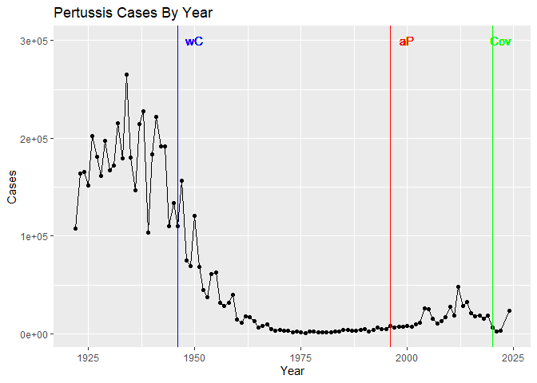
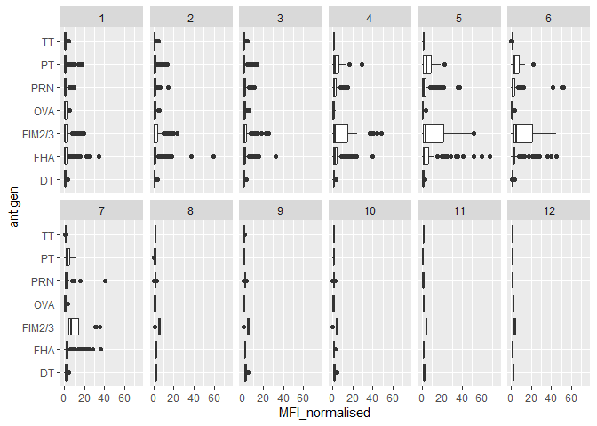
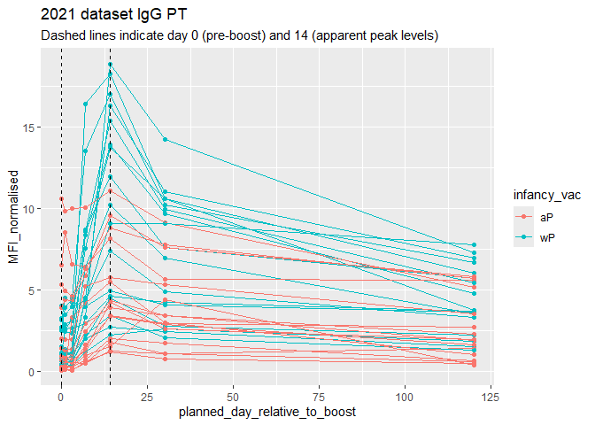

# Lab 15 Investigating Pertussis Resurgence Mini Lab
Daniel Gurholt (PID: A16767491)

## Background

Pertussis, a.k.a whooping cough, is a highly infectious lung disease
caused by the bacteria *B Pertussis*. The CDC tracks case numbers per
year. Let’s have a closer look at this data.

[CDC
data](https://www.cdc.gov/pertussis/php/surveillance/pertussis-cases-by-year.html?CDC_AAref_Val=https://www.cdc.gov/pertussis/surv-reporting/cases-by-year.html)

We will use the datapasta R package to “scrape” this dataset into R.

> Q1. With the help of the R “addin” package datapasta assign the CDC
> pertussis case number data to a data frame called cdc and use ggplot
> to make a plot of cases numbers over time.

``` r
cdc<- data.frame(
                                Year = c(1922L,1923L,1924L,1925L,1926L,
                                         1927L,1928L,1929L,1930L,1931L,
                                         1932L,1933L,1934L,1935L,1936L,1937L,
                                         1938L,1939L,1940L,1941L,1942L,
                                         1943L,1944L,1945L,1946L,1947L,1948L,
                                         1949L,1950L,1951L,1952L,1953L,1954L,
                                         1955L,1956L,1957L,1958L,1959L,
                                         1960L,1961L,1962L,1963L,1964L,1965L,
                                         1966L,1967L,1968L,1969L,1970L,
                                         1971L,1972L,1973L,1974L,1975L,1976L,
                                         1977L,1978L,1979L,1980L,1981L,
                                         1982L,1983L,1984L,1985L,1986L,1987L,
                                         1988L,1989L,1990L,1991L,1992L,1993L,
                                         1994L,1995L,1996L,1997L,1998L,
                                         1999L,2000L,2001L,2002L,2003L,2004L,
                                         2005L,2006L,2007L,2008L,2009L,
                                         2010L,2011L,2012L,2013L,2014L,2015L,
                                         2016L,2017L,2018L,2019L,2020L,
                                         2021L,2022L,2024L),
                               Cases = c(107473,164191,165418,152003,
                                         202210,181411,161799,197371,166914,
                                         172559,215343,179135,265269,180518,
                                         147237,214652,227319,103188,183866,
                                         222202,191383,191890,109873,133792,
                                         109860,156517,74715,69479,120718,
                                         68687,45030,37129,60886,62786,
                                         31732,28295,32148,40005,14809,11468,
                                         17749,17135,13005,6799,7717,9718,
                                         4810,3285,4249,3036,3287,1759,
                                         2402,1738,1010,2177,2063,1623,1730,
                                         1248,1895,2463,2276,3589,4195,
                                         2823,3450,4157,4570,2719,4083,6586,
                                         4617,5137,7796,6564,7405,7298,
                                         7867,7580,9771,11647,25827,25616,
                                         15632,10454,13278,16858,27550,18719,
                                         48277,28639,32971,20762,17972,
                                         18975,15609,18617,6124,2116, 3044,23544)
      )
```

``` r
library(ggplot2)

cdcgraph<- ggplot(cdc)+ 
  aes(Year, Cases)+ 
  geom_point()+
  geom_line()+
  labs(title= "Pertussis Cases By Year")

cdcgraph
```


Add some landmarks as annotation to our plot. We include the first
whole-cell (wP) vaccine roll-out in 1940.

> Q2. Using the ggplot geom_vline() function add lines to your previous
> plot for the 1946 introduction of the wP vaccine and the 1996 switch
> to aP vaccine (see example in the hint below). What do you notice?

``` r
cdcgraph + 
  geom_vline(xintercept=1946, col="blue")+ 
  geom_text(aes(x = 1950, y = 300000, label = "wC"), color="blue")
```

    Warning in geom_text(aes(x = 1950, y = 3e+05, label = "wC"), color = "blue"): All aesthetics have length 1, but the data has 102 rows.
    ℹ Please consider using `annotate()` or provide this layer with data containing
      a single row.


Let’s add the switch to acellular (aP) in 1996.

``` r
cdcgraph + 
  geom_vline(xintercept=1946, col="blue")+
  geom_vline(xintercept=1996, col="red")+
  geom_text(aes(x = 1950, y = 300000, label = "wC"), color="blue")+
  geom_text(aes(x = 2000, y = 300000, label = "aP"), color="red")
```

    Warning in geom_text(aes(x = 1950, y = 3e+05, label = "wC"), color = "blue"): All aesthetics have length 1, but the data has 102 rows.
    ℹ Please consider using `annotate()` or provide this layer with data containing
      a single row.

    Warning in geom_text(aes(x = 2000, y = 3e+05, label = "aP"), color = "red"): All aesthetics have length 1, but the data has 102 rows.
    ℹ Please consider using `annotate()` or provide this layer with data containing
      a single row.


I noticed that before the whole cell vaccine, the number of cases were
very high, but when the whole cell vaccine was originally introduced in
1946, there is a dramatic decrease in pertussis cases that got very
close to zero for many years as the large majority of the population
gain resistance.

> Q3. Describe what happened after the introduction of the aP vaccine?
> Do you have a possible explanation for the observed trend?

The addition of the acellular aP vaccine continued to keep cases low for
a couple of years which showed its effectiveness until the anti-vax
movement came along in the mid 2000s and 2010s which cause less people
to be vaccinated which is why we can see a noticeable spike in case as
they start to rise with more people not being vaccinated. Waning
immunity, and increased PCR testing may also be hypothesized for this
increase.

Let’s add COVID to the plot:

``` r
cdcgraph + 
  geom_vline(xintercept=1946, col="blue")+
  geom_vline(xintercept=1996, col="red")+ 
  geom_vline(xintercept= 2020, col="green")+
  geom_text(aes(x = 1950, y = 300000, label = "wC"), color="blue")+
  geom_text(aes(x = 2000, y = 300000, label = "aP"), color="red")+
  geom_text(aes(x = 2022, y = 300000, label = "Cov"), color="green")
```

    Warning in geom_text(aes(x = 1950, y = 3e+05, label = "wC"), color = "blue"): All aesthetics have length 1, but the data has 102 rows.
    ℹ Please consider using `annotate()` or provide this layer with data containing
      a single row.

    Warning in geom_text(aes(x = 2000, y = 3e+05, label = "aP"), color = "red"): All aesthetics have length 1, but the data has 102 rows.
    ℹ Please consider using `annotate()` or provide this layer with data containing
      a single row.

    Warning in geom_text(aes(x = 2022, y = 3e+05, label = "Cov"), color = "green"): All aesthetics have length 1, but the data has 102 rows.
    ℹ Please consider using `annotate()` or provide this layer with data containing
      a single row.



**Key Question**: Why does the aP vaccine induced immunity wane faster
than that of the wP vaccine?

\##CMI-PB

The CMI-PB (Computational Models of Immunity Pertussis Boost) makes
available lots of data about the immune response to Pertussis Booster
vaccination.

Critically, it tracks wP and aP individuals over time to see how their
immune response changes.

CMI-PB make all their data freely available via JSON format tables from
their database

Let’s red the first one of these tables…

``` r
library(jsonlite)
```

    Warning: package 'jsonlite' was built under R version 4.4.2

``` r
subject<- read_json("http://cmi-pb.org/api/v5/subject", simplifyVector=T)

head(subject)
```

      subject_id infancy_vac biological_sex              ethnicity  race
    1          1          wP         Female Not Hispanic or Latino White
    2          2          wP         Female Not Hispanic or Latino White
    3          3          wP         Female                Unknown White
    4          4          wP           Male Not Hispanic or Latino Asian
    5          5          wP           Male Not Hispanic or Latino Asian
    6          6          wP         Female Not Hispanic or Latino White
      year_of_birth date_of_boost      dataset
    1    1986-01-01    2016-09-12 2020_dataset
    2    1968-01-01    2019-01-28 2020_dataset
    3    1983-01-01    2016-10-10 2020_dataset
    4    1988-01-01    2016-08-29 2020_dataset
    5    1991-01-01    2016-08-29 2020_dataset
    6    1988-01-01    2016-10-10 2020_dataset

> Q. How many subjects are there in this dataset?

``` r
nrow(subject)
```

    [1] 172

> Q4. How many aP and wP infancy vaccinated subjects are in the dataset?

``` r
table(subject$infancy_vac)
```


    aP wP 
    87 85 

There are 87 aP vaccinated and 85 wP vaccinated subjects in this dataset

> Q5. How many Male and Female subjects/patients are in the dataset?

``` r
table(subject$biological_sex)
```


    Female   Male 
       112     60 

There are 112 female subjects and 60nmale subjects in this dataset

> Q6. What is the breakdown of race and biological sex (e.g. number of
> Asian females, White males etc…)?

``` r
table(subject$race, subject$biological_sex)
```

                                               
                                                Female Male
      American Indian/Alaska Native                  0    1
      Asian                                         32   12
      Black or African American                      2    3
      More Than One Race                            15    4
      Native Hawaiian or Other Pacific Islander      1    1
      Unknown or Not Reported                       14    7
      White                                         48   32

\##Side-Note: Working with dates

> Q7. Using this approach determine (i) the average age of wP
> individuals, (ii) the average age of aP individuals; and (iii) are
> they significantly different?

``` r
library(lubridate)
```

    Warning: package 'lubridate' was built under R version 4.4.2


    Attaching package: 'lubridate'

    The following objects are masked from 'package:base':

        date, intersect, setdiff, union

``` r
subject$age <- today() - ymd(subject$year_of_birth)
```

``` r
library(dplyr)
```


    Attaching package: 'dplyr'

    The following objects are masked from 'package:stats':

        filter, lag

    The following objects are masked from 'package:base':

        intersect, setdiff, setequal, union

``` r
ap <- subject %>% filter(infancy_vac == "aP")

round( summary( time_length( ap$age, "years" ) ) )
```

       Min. 1st Qu.  Median    Mean 3rd Qu.    Max. 
         22      26      27      27      28      34 

``` r
wp <- subject %>% filter(infancy_vac == "wP")
round( summary( time_length( wp$age, "years" ) ) )
```

       Min. 1st Qu.  Median    Mean 3rd Qu.    Max. 
         22      32      34      36      39      57 

``` r
head(wp)
```

      subject_id infancy_vac biological_sex              ethnicity  race
    1          1          wP         Female Not Hispanic or Latino White
    2          2          wP         Female Not Hispanic or Latino White
    3          3          wP         Female                Unknown White
    4          4          wP           Male Not Hispanic or Latino Asian
    5          5          wP           Male Not Hispanic or Latino Asian
    6          6          wP         Female Not Hispanic or Latino White
      year_of_birth date_of_boost      dataset        age
    1    1986-01-01    2016-09-12 2020_dataset 14220 days
    2    1968-01-01    2019-01-28 2020_dataset 20795 days
    3    1983-01-01    2016-10-10 2020_dataset 15316 days
    4    1988-01-01    2016-08-29 2020_dataset 13490 days
    5    1991-01-01    2016-08-29 2020_dataset 12394 days
    6    1988-01-01    2016-10-10 2020_dataset 13490 days

``` r
ttest<- t.test(round( summary( time_length( ap$age, "years" ) ) ), round( summary( time_length( wp$age, "years" ) ) ))

ttest
```


        Welch Two Sample t-test

    data:  round(summary(time_length(ap$age, "years"))) and round(summary(time_length(wp$age, "years")))
    t = -1.8809, df = 6.1212, p-value = 0.108
    alternative hypothesis: true difference in means is not equal to 0
    95 percent confidence interval:
     -21.417056   2.750389
    sample estimates:
    mean of x mean of y 
     27.33333  36.66667 

The average age of aP individuals is 27 years and the average age of wP
individuals is 36 years. From the t-test the p value of 0.108 shows that
there is not a significant age difference between ap and wp individuals

> Q8. Determine the age of all individuals at time of boost?

``` r
int <- ymd(subject$date_of_boost) - ymd(subject$year_of_birth)
age_at_boost <- time_length(int, "year")
head(age_at_boost)
```

    [1] 30.69678 51.07461 33.77413 28.65982 25.65914 28.77481

> Q9. With the help of a faceted boxplot or histogram (see below), do
> you think these two groups are significantly different?

``` r
ggplot(subject) +
  aes(time_length(age, "year"),
      fill=as.factor(infancy_vac)) +
  geom_boxplot(show.legend=FALSE) +
  facet_wrap(vars(infancy_vac), nrow=2) +
  xlab("Age in years")
```


These two groups are not statistically significant because the outliers
and standard deviation of the two groups are overlapping each other.

\##Joining multiple tables

``` r
specimen<- read_json("http://cmi-pb.org/api/v5/specimen", simplifyVector=T)

head(specimen)
```

      specimen_id subject_id actual_day_relative_to_boost
    1           1          1                           -3
    2           2          1                            1
    3           3          1                            3
    4           4          1                            7
    5           5          1                           11
    6           6          1                           32
      planned_day_relative_to_boost specimen_type visit
    1                             0         Blood     1
    2                             1         Blood     2
    3                             3         Blood     3
    4                             7         Blood     4
    5                            14         Blood     5
    6                            30         Blood     6

> Q9. Complete the code to join specimen and subject tables to make a
> new merged data frame containing all specimen records along with their
> associated subject details:

Now we can join or merge these two tables to make one new meta table
with the combined data

``` r
library(dplyr)

meta<- inner_join(specimen, subject)
```

    Joining with `by = join_by(subject_id)`

``` r
dim(meta)
```

    [1] 1503   14

``` r
head(meta)
```

      specimen_id subject_id actual_day_relative_to_boost
    1           1          1                           -3
    2           2          1                            1
    3           3          1                            3
    4           4          1                            7
    5           5          1                           11
    6           6          1                           32
      planned_day_relative_to_boost specimen_type visit infancy_vac biological_sex
    1                             0         Blood     1          wP         Female
    2                             1         Blood     2          wP         Female
    3                             3         Blood     3          wP         Female
    4                             7         Blood     4          wP         Female
    5                            14         Blood     5          wP         Female
    6                            30         Blood     6          wP         Female
                   ethnicity  race year_of_birth date_of_boost      dataset
    1 Not Hispanic or Latino White    1986-01-01    2016-09-12 2020_dataset
    2 Not Hispanic or Latino White    1986-01-01    2016-09-12 2020_dataset
    3 Not Hispanic or Latino White    1986-01-01    2016-09-12 2020_dataset
    4 Not Hispanic or Latino White    1986-01-01    2016-09-12 2020_dataset
    5 Not Hispanic or Latino White    1986-01-01    2016-09-12 2020_dataset
    6 Not Hispanic or Latino White    1986-01-01    2016-09-12 2020_dataset
             age
    1 14220 days
    2 14220 days
    3 14220 days
    4 14220 days
    5 14220 days
    6 14220 days

> Q10. Now using the same procedure join meta with titer data so we can
> further analyze this data in terms of time of visit aP/wP, male/female
> etc.

``` r
abdata<- read_json("http://cmi-pb.org/api/v5/plasma_ab_titer", simplifyVector = T)
head(abdata)
```

      specimen_id isotype is_antigen_specific antigen        MFI MFI_normalised
    1           1     IgE               FALSE   Total 1110.21154       2.493425
    2           1     IgE               FALSE   Total 2708.91616       2.493425
    3           1     IgG                TRUE      PT   68.56614       3.736992
    4           1     IgG                TRUE     PRN  332.12718       2.602350
    5           1     IgG                TRUE     FHA 1887.12263      34.050956
    6           1     IgE                TRUE     ACT    0.10000       1.000000
       unit lower_limit_of_detection
    1 UG/ML                 2.096133
    2 IU/ML                29.170000
    3 IU/ML                 0.530000
    4 IU/ML                 6.205949
    5 IU/ML                 4.679535
    6 IU/ML                 2.816431

``` r
ab<- inner_join(abdata, meta)
```

    Joining with `by = join_by(specimen_id)`

``` r
head(ab)
```

      specimen_id isotype is_antigen_specific antigen        MFI MFI_normalised
    1           1     IgE               FALSE   Total 1110.21154       2.493425
    2           1     IgE               FALSE   Total 2708.91616       2.493425
    3           1     IgG                TRUE      PT   68.56614       3.736992
    4           1     IgG                TRUE     PRN  332.12718       2.602350
    5           1     IgG                TRUE     FHA 1887.12263      34.050956
    6           1     IgE                TRUE     ACT    0.10000       1.000000
       unit lower_limit_of_detection subject_id actual_day_relative_to_boost
    1 UG/ML                 2.096133          1                           -3
    2 IU/ML                29.170000          1                           -3
    3 IU/ML                 0.530000          1                           -3
    4 IU/ML                 6.205949          1                           -3
    5 IU/ML                 4.679535          1                           -3
    6 IU/ML                 2.816431          1                           -3
      planned_day_relative_to_boost specimen_type visit infancy_vac biological_sex
    1                             0         Blood     1          wP         Female
    2                             0         Blood     1          wP         Female
    3                             0         Blood     1          wP         Female
    4                             0         Blood     1          wP         Female
    5                             0         Blood     1          wP         Female
    6                             0         Blood     1          wP         Female
                   ethnicity  race year_of_birth date_of_boost      dataset
    1 Not Hispanic or Latino White    1986-01-01    2016-09-12 2020_dataset
    2 Not Hispanic or Latino White    1986-01-01    2016-09-12 2020_dataset
    3 Not Hispanic or Latino White    1986-01-01    2016-09-12 2020_dataset
    4 Not Hispanic or Latino White    1986-01-01    2016-09-12 2020_dataset
    5 Not Hispanic or Latino White    1986-01-01    2016-09-12 2020_dataset
    6 Not Hispanic or Latino White    1986-01-01    2016-09-12 2020_dataset
             age
    1 14220 days
    2 14220 days
    3 14220 days
    4 14220 days
    5 14220 days
    6 14220 days

``` r
dim(ab)
```

    [1] 52576    21

> Q11. How many specimens (i.e. entries in abdata) do we have for each
> isotype?

``` r
table(ab$isotype)
```


      IgE   IgG  IgG1  IgG2  IgG3  IgG4 
     6698  5389 10117 10124 10124 10124 

> Q12. What are the different \$dataset values in abdata and what do you
> notice about the number of rows for the most “recent” dataset?

``` r
table(ab$dataset)
```


    2020_dataset 2021_dataset 2022_dataset 2023_dataset 
           31520         8085         7301         5670 

The different \$dataset values describe how many samples were taken in a
specific year and as the years get more recent, the amount of rows
decreases which shows that we havent collected as many samples or
analyzed as many in 2023 compared to 2023 partially because less time
has passed from 2023 to 2024 so we need more time to analyze samples.

\##Examine IgG Ab titer levels

``` r
table(ab$antigen)
```


        ACT   BETV1      DT   FELD1     FHA  FIM2/3   LOLP1     LOS Measles     OVA 
       1970    1970    4978    1970    5372    4978    1970    1970    1970    4978 
        PD1     PRN      PT     PTM   Total      TT 
       1970    5372    5372    1970     788    4978 

Let’s focus on IgG- one of the main antibody types responsive to
bacteria or viral infections

``` r
igg<- filter(ab, isotype=="IgG")
head(igg)
```

      specimen_id isotype is_antigen_specific antigen        MFI MFI_normalised
    1           1     IgG                TRUE      PT   68.56614       3.736992
    2           1     IgG                TRUE     PRN  332.12718       2.602350
    3           1     IgG                TRUE     FHA 1887.12263      34.050956
    4          19     IgG                TRUE      PT   20.11607       1.096366
    5          19     IgG                TRUE     PRN  976.67419       7.652635
    6          19     IgG                TRUE     FHA   60.76626       1.096457
       unit lower_limit_of_detection subject_id actual_day_relative_to_boost
    1 IU/ML                 0.530000          1                           -3
    2 IU/ML                 6.205949          1                           -3
    3 IU/ML                 4.679535          1                           -3
    4 IU/ML                 0.530000          3                           -3
    5 IU/ML                 6.205949          3                           -3
    6 IU/ML                 4.679535          3                           -3
      planned_day_relative_to_boost specimen_type visit infancy_vac biological_sex
    1                             0         Blood     1          wP         Female
    2                             0         Blood     1          wP         Female
    3                             0         Blood     1          wP         Female
    4                             0         Blood     1          wP         Female
    5                             0         Blood     1          wP         Female
    6                             0         Blood     1          wP         Female
                   ethnicity  race year_of_birth date_of_boost      dataset
    1 Not Hispanic or Latino White    1986-01-01    2016-09-12 2020_dataset
    2 Not Hispanic or Latino White    1986-01-01    2016-09-12 2020_dataset
    3 Not Hispanic or Latino White    1986-01-01    2016-09-12 2020_dataset
    4                Unknown White    1983-01-01    2016-10-10 2020_dataset
    5                Unknown White    1983-01-01    2016-10-10 2020_dataset
    6                Unknown White    1983-01-01    2016-10-10 2020_dataset
             age
    1 14220 days
    2 14220 days
    3 14220 days
    4 15316 days
    5 15316 days
    6 15316 days

Make a first plot of MFI (Mean Fluoresence Intensity measure of how much
is detected) for each antigen.

``` r
ggplot(igg)+ 
  aes(MFI_normalised, antigen)+
  geom_boxplot()
```


Lets color by aP/wP infancy_vac

``` r
ggplot(igg)+ 
  aes(MFI_normalised, antigen, col=infancy_vac)+
  geom_boxplot()
```


> Q13. Complete the following code to make a summary boxplot of Ab titer
> levels (MFI) for all antigens:

``` r
ggplot(igg)+ 
  aes(MFI_normalised, antigen)+
  geom_boxplot() +
  xlim(0,75) +
  facet_wrap(vars(visit), nrow=2)
```

    Warning: Removed 5 rows containing non-finite outside the scale range
    (`stat_boxplot()`).



> Q14. What antigens show differences in the level of IgG antibody
> titers recognizing them over time? Why these and not others?

FIM2/3, FHA, PT, and PRN show differences in the level of IgG antibody
titers recognizing them over time. Other antigens do not show this
difference because they probably are not critical for the function of
these vaccines or are not present in the pertussis bacteria.

Looks like we don’t have data yet for all subjects in terms of visits 8
and onwards. So let’s exclude some of these

``` r
igg_7<- filter(igg, visit %in% 1:7)
table(igg_7$visit)
```


      1   2   3   4   5   6   7 
    902 902 930 559 559 540 525 

``` r
ggplot(igg_7)+ 
  aes(MFI_normalised, antigen, col=infancy_vac)+
  geom_boxplot() +
  facet_wrap(~visit, ncol=2)
```


``` r
igg_7 %>% filter(visit != 8) %>%
ggplot() +
  aes(MFI_normalised, antigen, col=infancy_vac ) +
  geom_boxplot(show.legend = FALSE) + 
  xlim(0,75) +
  facet_wrap(vars(infancy_vac, visit), nrow=2)
```

    Warning: Removed 5 rows containing non-finite outside the scale range
    (`stat_boxplot()`).


> Q15. Filter to pull out only two specific antigens for analysis and
> create a boxplot for each. You can chose any you like. Below I picked
> a “control” antigen (“OVA”, that is not in our vaccines) and a clear
> antigen of interest (“PT”, Pertussis Toxin, one of the key virulence
> factors produced by the bacterium B. pertussis).

``` r
filter(igg, antigen=="OVA") %>%
  ggplot() +
  aes(MFI_normalised, col=infancy_vac) +
  geom_boxplot(show.legend = F) +
  facet_wrap(vars(visit)) +
  theme_bw()
```


``` r
filter(igg, antigen=="FIM2/3") %>%
  ggplot() +
  aes(MFI_normalised, col=infancy_vac) +
  geom_boxplot(show.legend = F) +
  facet_wrap(vars(visit)) +
  theme_bw()
```


``` r
filter(igg, antigen=="PT") %>%
  ggplot() +
  aes(MFI_normalised, col=infancy_vac) +
  geom_boxplot(show.legend = F) +
  facet_wrap(vars(visit)) +
  theme_bw()
```


> Q16. What do you notice about these two antigens time courses and the
> PT data in particular?

The OVA control antigen shows low levels that do not increase or
decrease staying relatively stable for all the visits whereas the PT
antigen increase to dramatically higher levels compared to OVA and peaks
around visit 5 where it then decreases after that.

> Q17. Do you see any clear difference in aP vs. wP responses?

I do not notice any clear differences in aP vs. wP responses because the
outliers and standard deviations clearly overlap each other for all
visits so there seems to be no significant difference.

Let’s try a different plot. First focus on one antigen , start with PT
(Pertussin Toxin) and plot visit or time on the x axis and
MFI_normalized on the y axis.

``` r
abdata.21 <- ab %>% filter(dataset == "2021_dataset")

abdata.21 %>% 
  filter(isotype == "IgG",  antigen == "PT") %>%
  ggplot() +
    aes(x=planned_day_relative_to_boost,
        y=MFI_normalised,
        col=infancy_vac,
        group=subject_id) +
    geom_point() +
    geom_line() +
    geom_vline(xintercept=0, linetype="dashed") +
    geom_vline(xintercept=14, linetype="dashed") +
  labs(title="2021 dataset IgG PT",
       subtitle = "Dashed lines indicate day 0 (pre-boost) and 14 (apparent peak levels)")
```



> Q18. Does this trend look similar for the 2020 dataset?

``` r
abdata.20 <- ab %>% filter(dataset == "2020_dataset")

abdata.20 %>% 
  filter(isotype == "IgG",  antigen == "PT") %>%
  ggplot() +
    aes(x=planned_day_relative_to_boost,
        y=MFI_normalised,
        col=infancy_vac,
        group=subject_id) +
    geom_point() +
    geom_line() +
    xlim(0,125) +
    geom_vline(xintercept=0, linetype="dashed") +
    geom_vline(xintercept=14, linetype="dashed") +
  labs(title="2020 dataset IgG PT",
       subtitle = "Dashed lines indicate day 0 (pre-boost) and 14 (apparent peak levels)")
```

    Warning: Removed 3 rows containing missing values or values outside the scale range
    (`geom_point()`).

    Warning: Removed 3 rows containing missing values or values outside the scale range
    (`geom_line()`).


> Q18. Does this trend look similar for the 2020 dataset?

Other than the wP individuals not rising as high on the MFI_normalised
scale in 2020, the trend does look similar for both 2020 and 21 with
lots of variation from 0-30 days and it leveling off after that.

\##Obtaining CMI-PB RNASeq data

``` r
url <- "https://www.cmi-pb.org/api/v2/rnaseq?versioned_ensembl_gene_id=eq.ENSG00000211896.7"

rna <- read_json(url, simplifyVector = TRUE) 
```

``` r
ssrna <- inner_join(rna, meta)
```

    Joining with `by = join_by(specimen_id)`

> Q19. Make a plot of the time course of gene expression for IGHG1 gene
> (i.e. a plot of visit vs. tpm).

``` r
ggplot(ssrna) +
  aes(visit, tpm, group=subject_id) +
  geom_point() +
  geom_line(alpha=0.2)
```


> Q20.: What do you notice about the expression of this gene (i.e. when
> is it at it’s maximum level)?

When analyzing the expression of this gene when it is at it’s maximum
value, I noticed that the tpm value vary a lot at its peaks around visit
4, 5, and 6 but then decrease after that which shows there could be
slight differences between the aP and wP individuals but it is hard to
tell if they are significant or not.

> Q21. Does this pattern in time match the trend of antibody titer data?
> If not, why not?

This pattern in time does match the trend of antibody titer data in Q15
because tpm levels peak around visit 4 and 5 which is the same as the
antigen level peaks in the titer data which shows these levels are
matching each other as if they are connected and relate to one another.

``` r
ggplot(ssrna) +
  aes(tpm, col=infancy_vac) +
  geom_boxplot() +
  facet_wrap(vars(visit))
```


``` r
ssrna %>%  
  filter(visit==4) %>% 
  ggplot() +
    aes(tpm, col=infancy_vac) + geom_density() + 
    geom_rug() 
```


